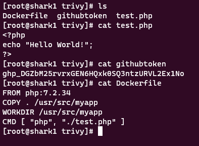
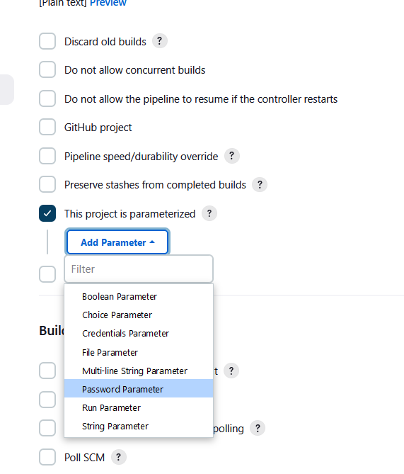
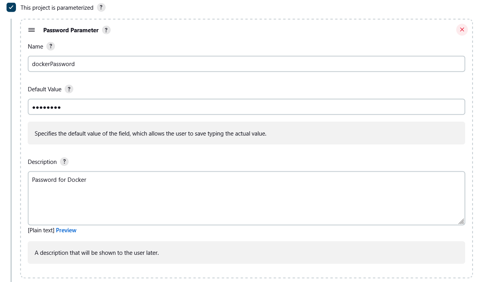
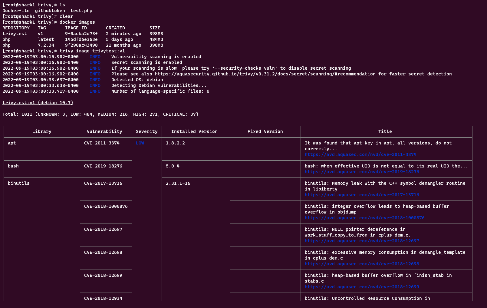
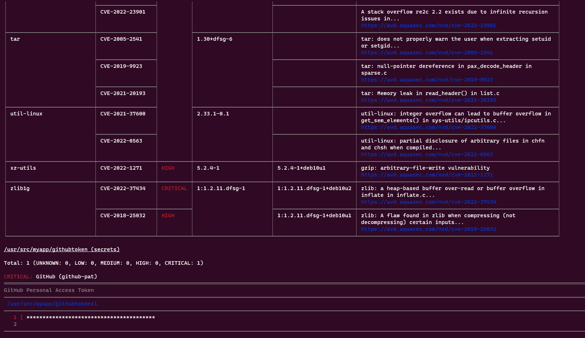

# Trivy Report


## Pull Images

Try to pull image php 7.2.34

```bash
docker pull php:7.2.34
```

## Create A Dockerfile

Create a folder containing Dockerfile, github access token, and a simple php program.


## Build Image

Continued by building the Dockerfile into an image.


## Misconfig Scanner

The Misconfig Scanner is used to scan the Dockerfile before the image is created, as the example below shows that the container must be run as a rootless container.


## Vulnerability Scanner

Vulnerability Scanner is used to scan if there are vulnerabilities that occur in the image, and can be fixed by updating the image.


## Secret Scanner

Trivy scans container image to detect exposed secrets like passwords, api keys, and tokens.

