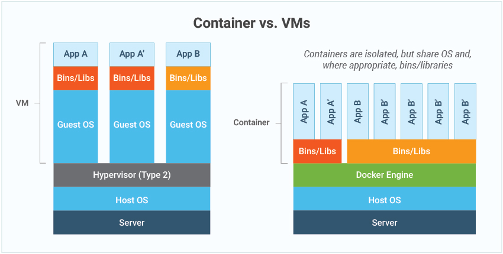

# Introduction Docker

## VM vs Container

Before the advent of container technology, people usually deployed applications on virtual machines. What usually happens is one vm in the contents of one application. This is usually done because to avoid dependecy collisions between applications.

However, using this traditional method is considered to cost more, because one VM has one operating system and of course it requires resources. In addition, major changes in system architecture from monolith to microservices, so that containerization technology is considered better for maintenance, because very large applications are broken up into small parts.

By using containers, we create an environment that is isolated from the outside according to what we need. We only need one engine and using the container engine we can create many containers that can communicate with each other. What's in the container won't interfere with what's on the host

## What is Docker ?

Docker is an open source platform that enables developers to build, deploy, run, update and manage containers—standardized, executable components that combine application source code with the operating system (OS) libraries and dependencies required to run that code in any environment.

Docker enables you to separate your applications from your infrastructure so you can deliver software quickly. With Docker, you can manage your infrastructure in the same ways you manage your applications. By taking advantage of Docker’s methodologies for shipping, testing, and deploying code quickly, you can significantly reduce the delay between writing code and running it in production.

## Docker Archictecture

### Docker Client

The Docker client (docker) is the primary way that many Docker users interact with Docker. When you use commands such as docker run, the client sends these commands to dockerd, which carries them out. The docker command uses the Docker API. The Docker client can communicate with more than one daemon.

### Docker Daemon

The Docker daemon (dockerd) listens for Docker API requests and manages Docker objects such as images, containers, networks, and volumes. A daemon can also communicate with other daemons to manage Docker services.

### Docker Registry

A Docker registry stores Docker images. Docker Hub is a public registry that anyone can use, and Docker is configured to look for images on Docker Hub by default. You can even run your own private registry.
When you use the docker pull or docker run commands, the required images are pulled from your configured registry. When you use the docker push command, your image is pushed to your configured registry. [Docker Hub](https://hub.docker.com/)

### Docker Images

Docker image is a static file with executable code that can create a container on a computing system. Docker image is immutable—meaning it cannot be changed, and can be deployed consistently in any environment. It is a core component of a containerized architecture. An image is a read-only template with instructions for creating a Docker container. Often, an image is based on another image, with some additional customization. For example, you may build an image which is based on the ubuntu image, but installs the Apache web server and your application, as well as the configuration details needed to make your application run.

### Containers

A container is a runnable instance of an image. You can create, start, stop, move, or delete a container using the Docker API or CLI. You can connect a container to one or more networks, attach storage to it, or even create a new image based on its current state.

Docker is a container engine that is used to create containers. Based on the above architecture, clients can create images, pull images, and create containers by calling the Docker daemon. to create a container, the client will run the docker run command, then the docker daemon will check according to what container to run so that, if the image to be used already exists on our premises, the container will be created immediately. However, if the image doesn't exist locally, the docker daemon will first pull the base image from the registry.

Docker is created using an image that already exists on our local machine. However, if we have several containers that use the same image, it doesn't mean that each container needs to draw the same image. Because the container works like a pointer that points to which image to choose as the base image to run the container. This supports the statement that containerization is considered lighter and cheaper.

## What can Docker use for ?

### Fast, consistent delivery of your applications

Docker streamlines the development lifecycle by allowing developers to work in standardized environments using local containers which provide your applications and services. Containers are great for continuous integration and continuous delivery (CI/CD) workflows.

Consider the following example scenario:

- Your developers write code locally and share their work with their colleagues using Docker containers.
- They use Docker to push their applications into a test environment and execute automated and manual tests.
- When developers find bugs, they can fix them in the development environment and redeploy them to the test environment for testing and validation.
- When testing is complete, getting the fix to the customer is as simple as pushing the updated image to the production environment.

### Responsive deployment and scaling

Docker’s container-based platform allows for highly portable workloads. Docker containers can run on a developer’s local laptop, on physical or virtual machines in a data center, on cloud providers, or in a mixture of environments.

Docker’s portability and lightweight nature also make it easy to dynamically manage workloads, scaling up or tearing down applications and services as business needs dictate, in near real time.

### Running more workloads on the same hardware

Docker is lightweight and fast. It provides a viable, cost-effective alternative to hypervisor-based virtual machines, so you can use more of your server capacity to achieve your business goals. Docker is perfect for high density environments and for small and medium deployments where you need to do more with fewer resources.