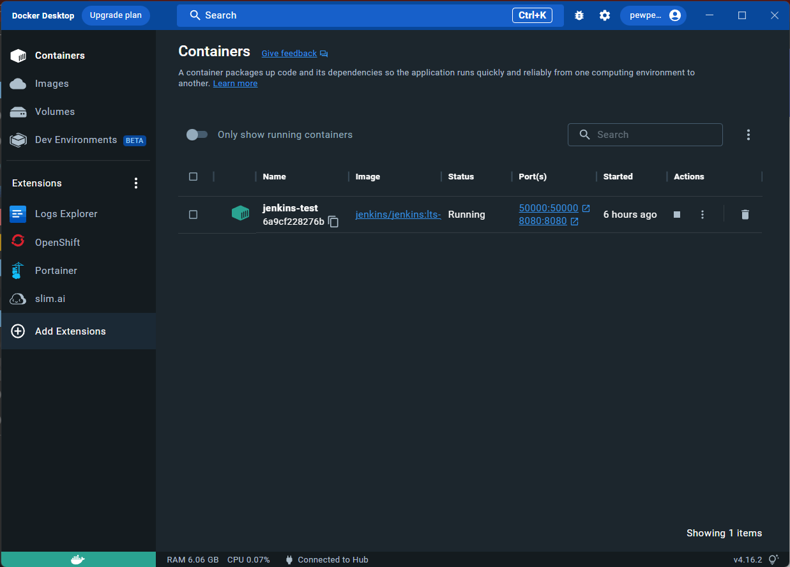
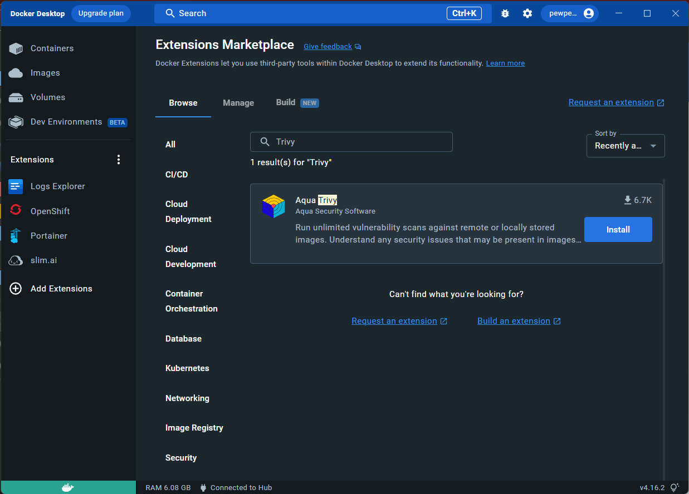
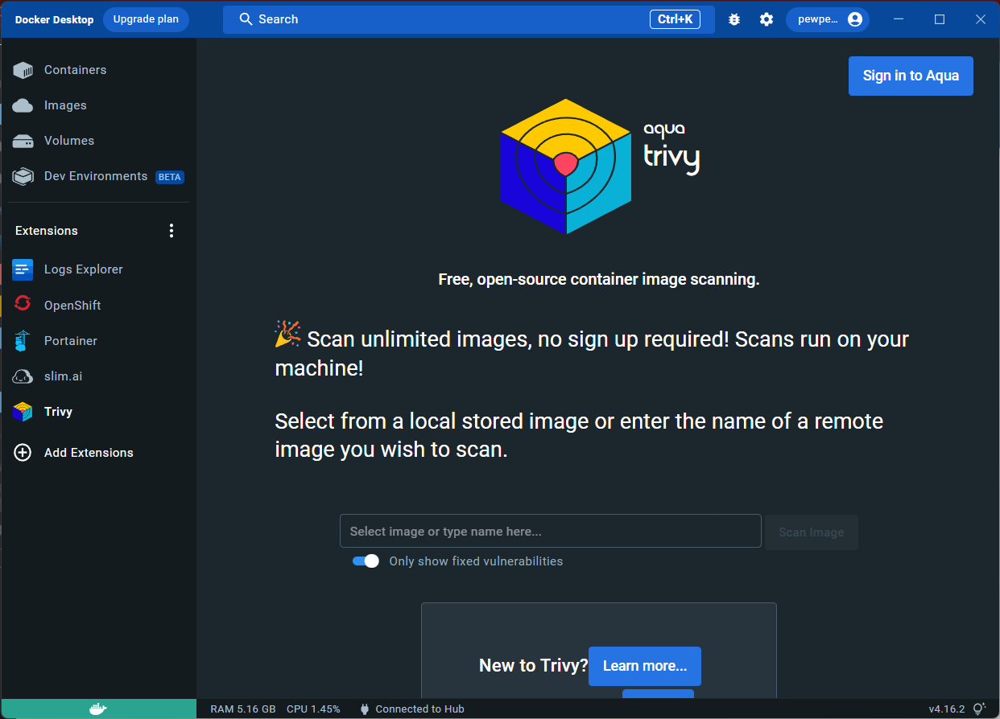

# Trivy

<p align="center">
  
</p>

Trivy is a comprehensive security scanner. It is reliable, fast, extremely easy to use, and it works wherever you need it. Trivy has different scanners that look for different security issues, and different targets where it can find those issues.

### Targets:

- Container Image
- Filesystem
- Git repository
- Kubernetes cluster or resource

### Scanners:

- OS packages and software dependencies in use
- Known vulnerabilities (CVEs)
- IaC misconfigurations
- Sensitive information and secrets

It is designed to be used in CI. Before pushing to a container registry or deploying your application, you can scan your local container image and other artifacts easily.

## Vulnerability Scanning


Trivy scans Container Images, Rootfs, Filesystem, and Git Repositories to detect vulnerabilities.

Trivy can scan container images for vulnerabilities based on the language-specific packages and os packages used to create these images.

Trivy can perform a rootfs scanner that can be used to scan for vulnerabilities on host machines, virtual machine images, and also the contents of containers that have been run.

Trivy can perform a vulnerability scan on the github repository. This will be very suitable if we want to implement trivy in the CI process as a vulnerability scanner before the image is built

Trivy can perform a file system scanner which is a scan to look for vulnerabilities in libraries or modules that will be used to create images.

The vulnerability report generated by trivy, will be displayed along with a solution on how to fix the vulnerability. So this will really help developers to improve the image, module, or library that they should use.

## Misconfiguration Scanning


Trivy provides built-in policies to detect configuration issues in Docker, Kubernetes, Terraform and CloudFormation. Also, you can write your own policies in [Rego](https://www.openpolicyagent.org/docs/latest/policy-language/) to scan JSON, YAML, etc, like [Conftest](https://github.com/open-policy-agent/conftest/).

Trivy will be very helpful if the configuration of the dockerfile or docker compose has a configuration that is less secure or less effective. Trivy will also display the results of the report along with possible solutions. So that if we find a vulnerability, we don't need to continue to the image build process

## Secret Scanning

Trivy scans any container image, filesystem and git repository to detect exposed secrets like passwords, api keys, and tokens. Secret scanning is enabled by default.

Trivy will scan every plaintext file, according to builtin rules or configuration. There are plenty of builtin rules:

- AWS access key
- GCP service account
- GitHub personal access token
- Gitlab personal access token
- Slack access token
- etc

## Installation

### Trivy CLI

Run `get install` command to install trivy

```bash
sudo apt-get install trivy
```

if command above don't work you will need to add trivy repo to your system, use steps below.
first install required dependency for installation.

```bash
sudo apt-get install wget apt-transport-https gnupg lsb-release
```

manually add trivy repo to your system using command below.

```bash
wget -qO - https://aquasecurity.github.io/trivy-repo/deb/public.key | gpg --dearmor | sudo tee /usr/share/keyrings/trivy.gpg > /dev/null
echo "deb [signed-by=/usr/share/keyrings/trivy.gpg] https://aquasecurity.github.io/trivy-repo/deb $(lsb_release -sc) main" | sudo tee -a /etc/apt/sources.list.d/trivy.list
```

Install trivy

```bash
sudo apt-get update
sudo apt-get install trivy
```

after installation is complete run `trivy` command on your terminal.

### Docker Desktop

You can use new feature on Docker desktop called extensions to install trivy for scanning your container images.

Prerequisite:
Docker Desktop installed and running on your system

1. On Home page docker desktop click Add Extensions


2. Search for Trivy and Install.


3. After Trivy successfully installed, you will see Trivy on left bar, from there you can scan any container image on your local system.
