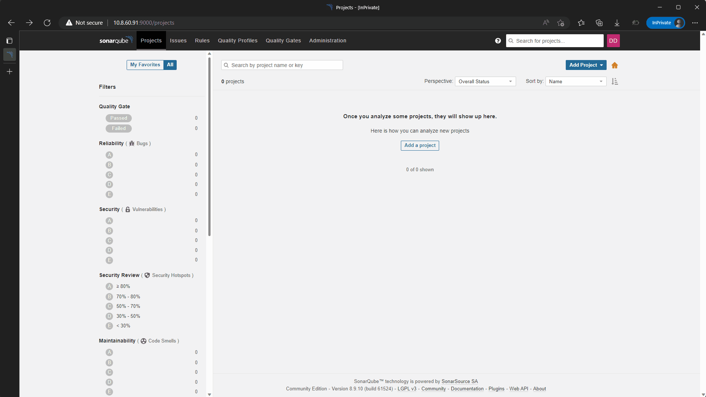
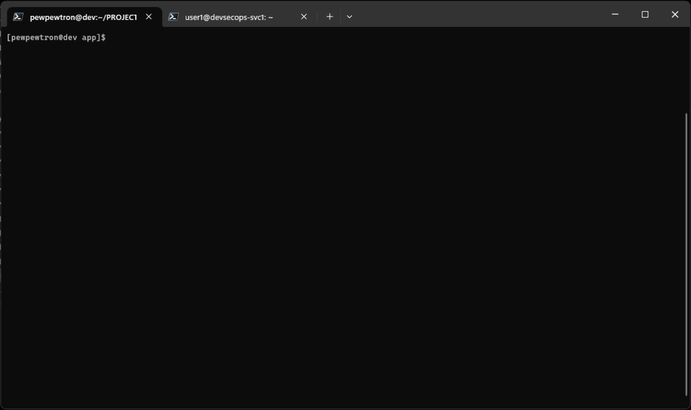
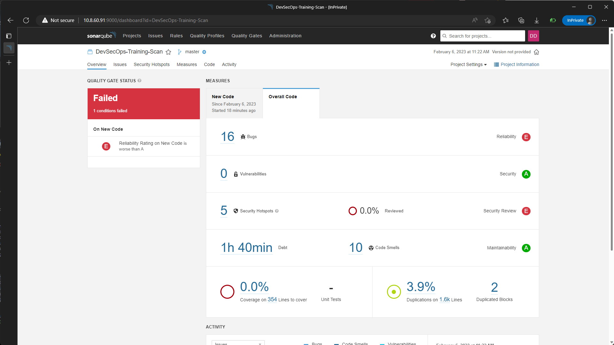

# Scan Repository Code with Sonar Scanner

Prerequisite

1. SonarQube server is installed.
2. SonarQube scanner is installed.
3. Code to Scann.

## Scanning your code Localy

Makesure your local system have sonar-scanner installed, to check use `sonar-scanner --version`.

### 1. Create new Project

Login to SonarQube instance via your browser `http://<YOUR-IP-ADDRESS>:9000`, and setup new Project.



### 2. Generate Token for Scanning your code

On your Project Overview page, you have option to Generate a token or Use existing token, here we will be create new token by giving it name for your token.


Save your token and then click continue, then the next prompt will ask your project type and what os you running on. after that SonarQube will give you snippet to scan your project.  

### 3. Scanning on your local System

Open a terminal session on your local machine and navigate to your project instance.

```bash
cd /your/code

# scan using sonar scanner
sonar-scanner \
-Dsonar.projectKey=DevSecOps-Training-Scan \
-Dsonar.sources=. \
-Dsonar.host.url=http://<sq-instance-address>:9000 \
-Dsonar.login=<project-token>
```



When scan process is complete you can find the result on SonarQube web Console.



## Scanning your code via Jenkins Pipeline
