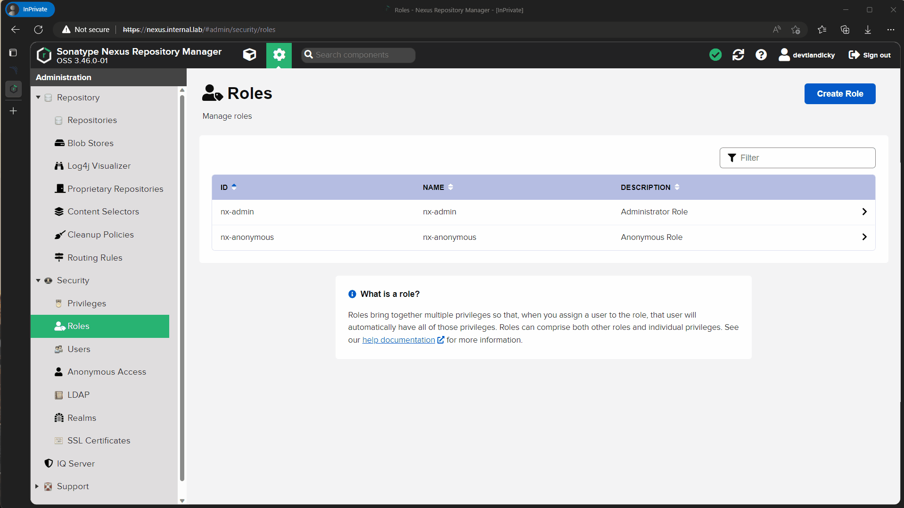
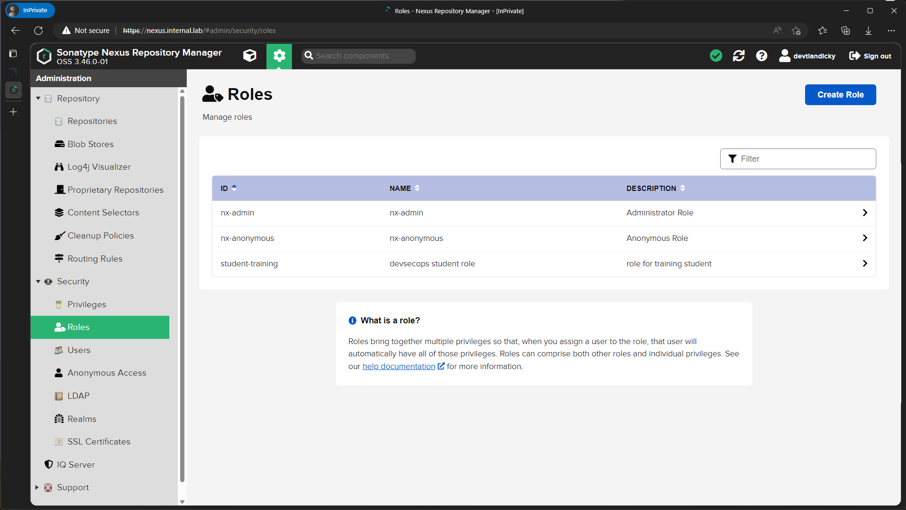
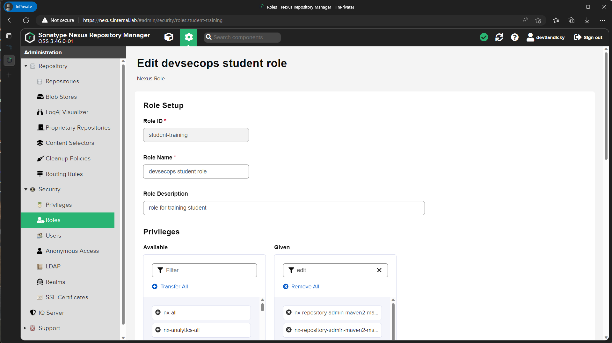
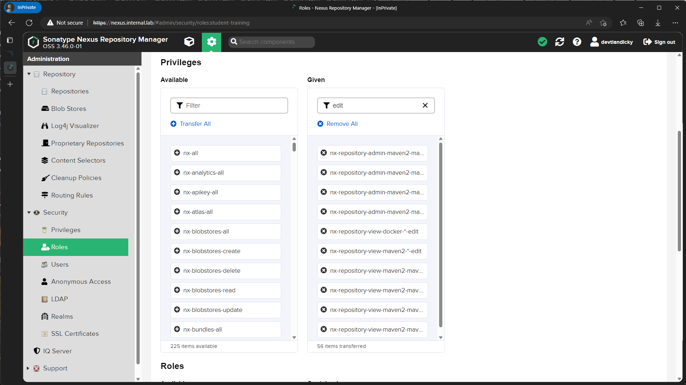
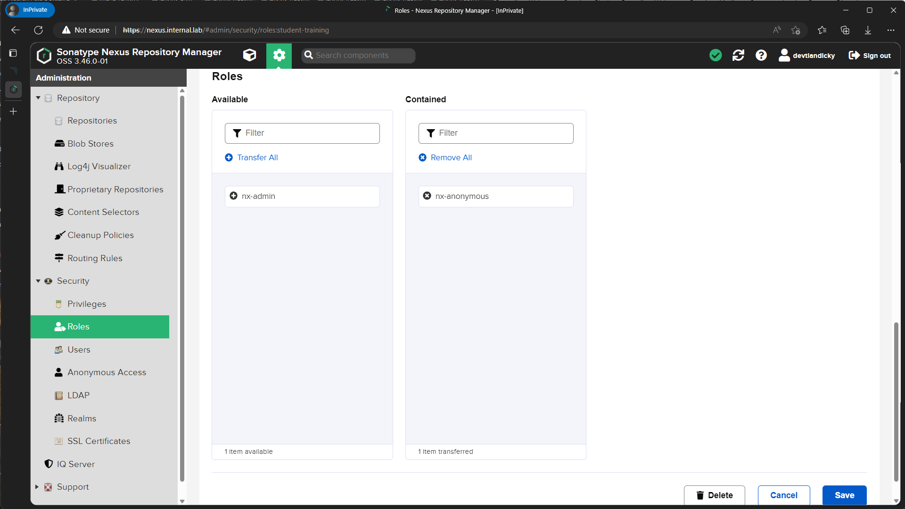
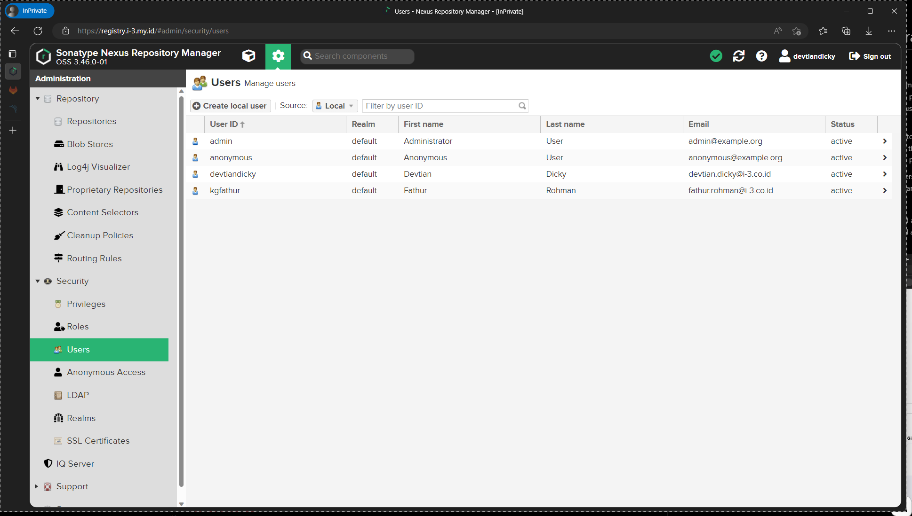
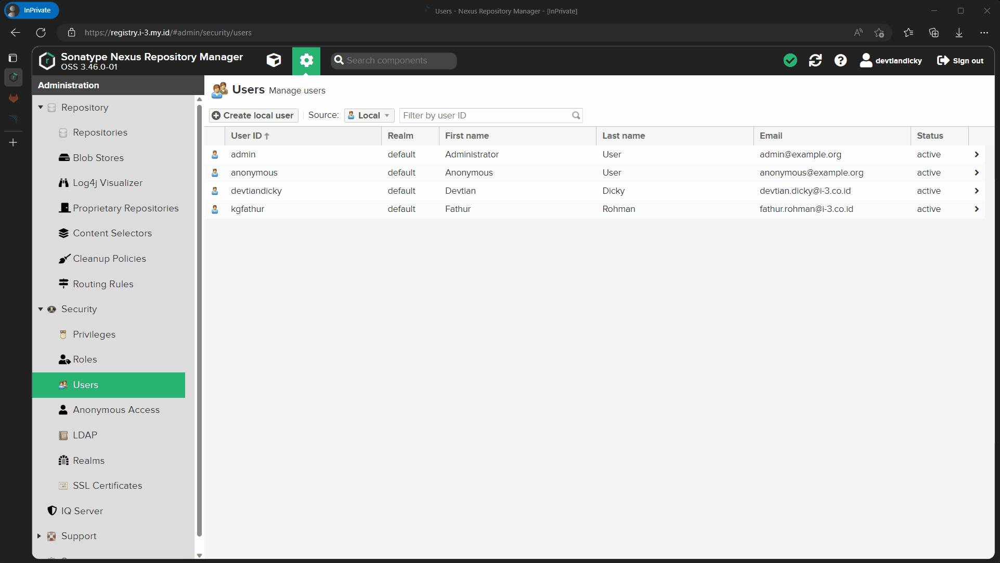
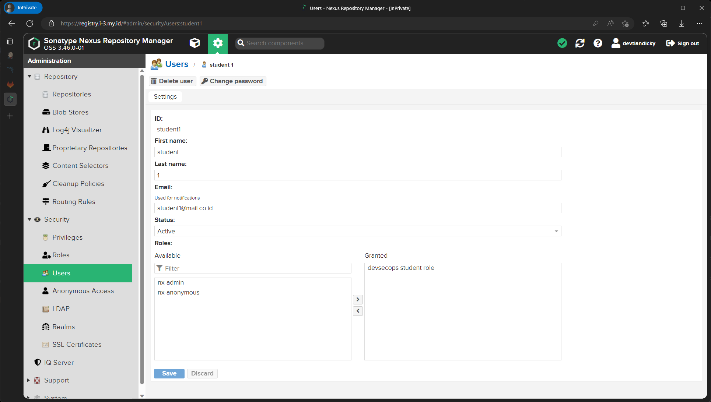

# Nexus Repository OSS Administration

## Manage Roles

In the Nexus Repository, a role is a set of permissions that determine what actions a user can perform within the repository. Roles are used to control access to the repository and the functions that users can perform within the repository. For example, a user with the Deployment role might be able to upload components to the repository, while a user with the Developer role might only be able to view and download components.

The Nexus Repository includes a set of predefined roles, but custom roles can also be created to meet the specific needs of an organization. The roles and permissions in Nexus Repository can be managed through the Nexus Repository web interface, allowing administrators to control access to the repository and the functions that users can perform.

Assigning roles to users helps to ensure that only authorized users have access to the repository and can perform specific actions within the repository, providing security and control over the components and dependencies stored in the repository.

### Create New Role

To create new role you need to login as administrative privileged account, then go to administration (settings icon), on security go to Roles then select create role, on Role Type select `Nexus Role` then fill all required form. administrator can select Privileges and Roles that already exist to customize new role being created.

### Edit Role

You cant edit existing role provided by nexus, but you can edit user defined role, To edit a role in the Nexus Repository, follow these steps:

1. Log in to the Nexus Repository web interface as an administrator.
2. Click on the "Security" menu item on the left-hand side of the screen.
3. Click on the "Roles" tab.
    
4. Find the role you want to edit in the list of roles and click on its name.
5. On the Role Details page, you can edit the name and description of the role
    

    administrator also can edit the permissions associated with the role.

    

    

6. Once you have made the desired changes, click on the "Save" button to save the changes to the role.

Note that changes to roles can affect multiple users, so be careful when editing roles to ensure that the changes you make are appropriate for the needs of your organization.

It's also worth mentioning that changes to roles can take some time to take effect, as they may need to be propagated to all users who have been assigned the role.

## Manage Users

Manage user can be done on administration then on security section select Users.

### Crete New User

Create user on nexus can be done on administration then on security section select user and Create local user. fill all required form and on Roles section, admin can give new user roles based on roles created on previous section.

### Edit User

Editing student work the same as Create new user, admin can select user to edit and will be directed to user edit form, other than edit user details, admin can change user password and delete user account.

## Manage Repo

### Create new Repository

#### Create new Blob storage

Before create a new repository its a good idea to create a new blob storage to separate data between repository, in this case we will create a new blob storage to store our images, to create a new blob storage follow steps below.

Login to your nexus web console then open server administration and configuration, on the side bar click Blob stores then select Create Blob Store to create new blob storage, first select type as an file since we will using local storage, then give your blob a name and specify your blob location, you can also create Quota for your blob here after that save the change and new blob storage is created and ready to be use by an repository.

#### Create Repo

After creating blob to store our image binary, now we need create a repo, the repo will use blob that we created before as storage media, step by step will be shown by image below.

After login open server administration and configuration menu then select repositories, click on Create repository here you will be have some option available select `docker (hosted)` to create internal registry, on Create repository form fill the option such name (indicate your repo name), Online (to accepts incoming requests), HTTP and give port that you want (user will connect to the registry via this port), on storage option select blob storage that we just created before, then create the repo.
