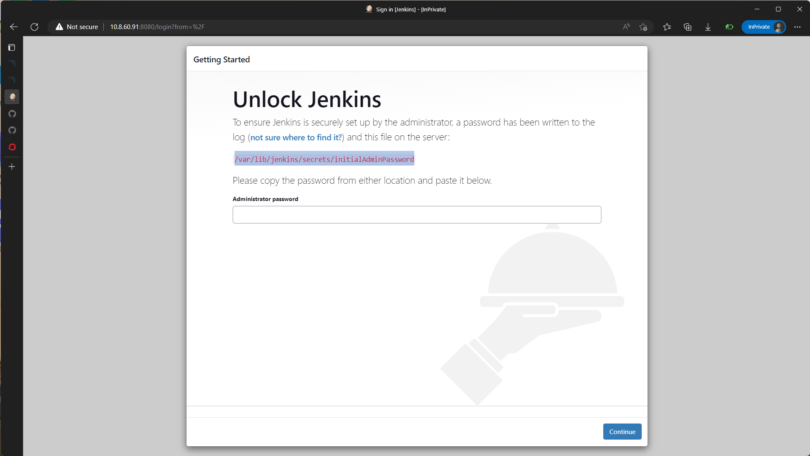
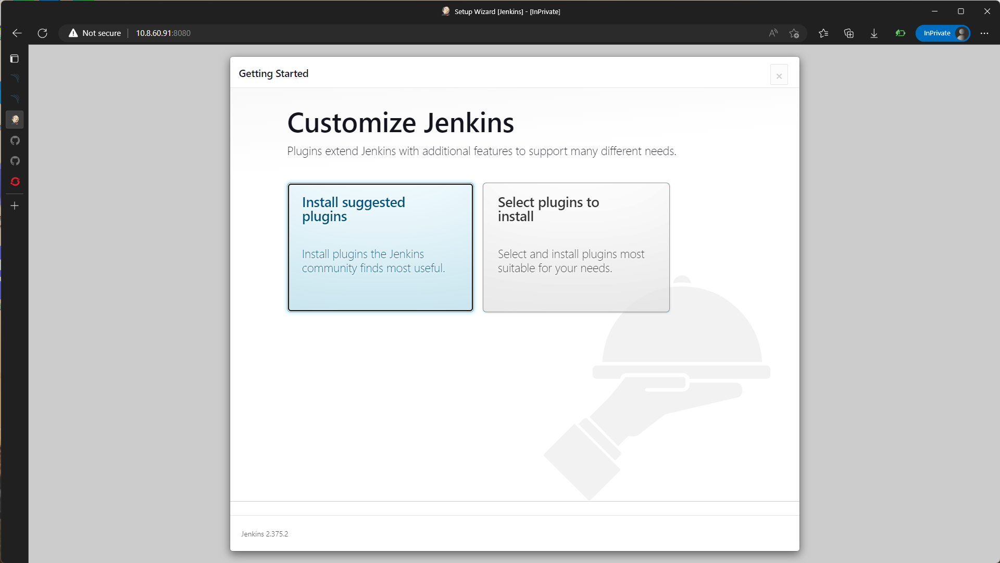
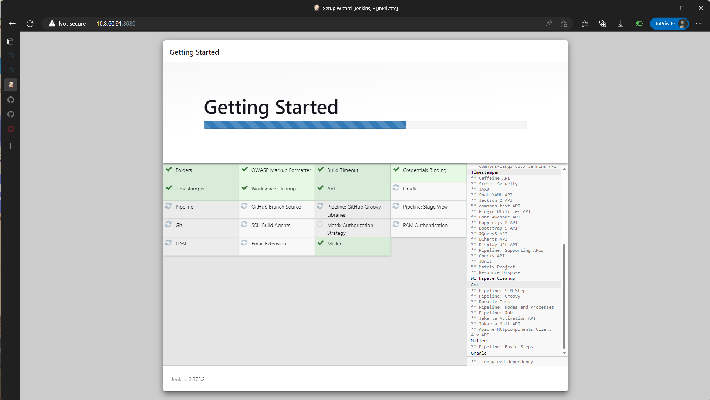
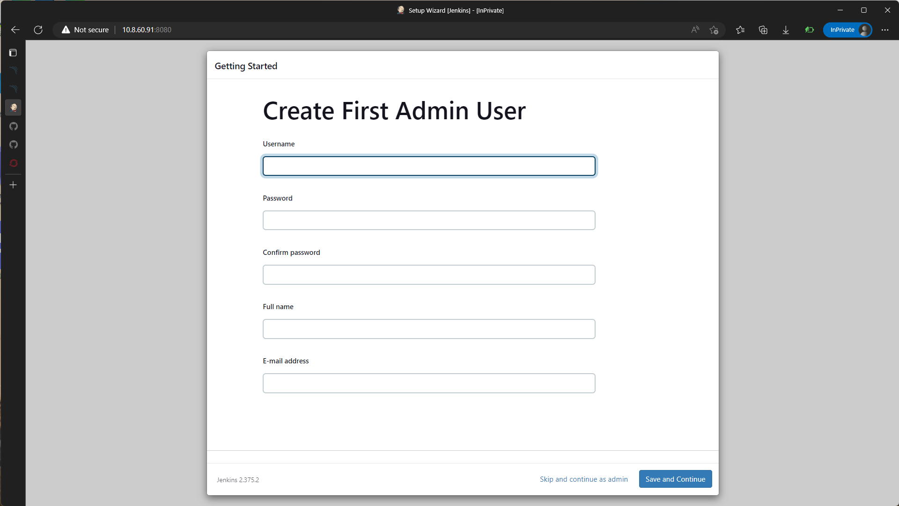
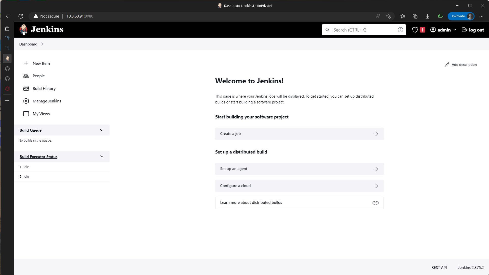

# Jenkins Installation

This guide will help you to set up and configure Jenkins on Ubuntu Server. Follow the steps given below for the complete Jenkins configuration.

## Jenkins Requirements

1. System: Ubuntu 20.04
2. 256 MB of RAM, 1 GB+ recommended
3. 1 GB of drive space (although 10 GB is a recommended minimum if running Jenkins as a Docker container)

## Installation Process

### 1. Install Java

You must install Java (Oracle JRE or OpenJDK) on the machine where you plan to run SonarQube:

```bash
sudo apt install openjdk-17-jre-headless
```

### 2. Add Jenkins repo

Add jenkins LTS release into your system using these command.

```bash
curl -fsSL https://pkg.jenkins.io/debian-stable/jenkins.io.key | sudo tee \
  /usr/share/keyrings/jenkins-keyring.asc > /dev/null
echo deb [signed-by=/usr/share/keyrings/jenkins-keyring.asc] \
  https://pkg.jenkins.io/debian-stable binary/ | sudo tee \
  /etc/apt/sources.list.d/jenkins.list > /dev/null
```

### 3. Install Jenkins

Install Jenkins using apt install.

```bash
# update first.
sudo apt-get update

sudo apt-get install jenkins
```

### 4. Start Jenkins Service

Start your jenkins Instance using systemctl as shown below.

```bash
sudo systemctl enable jenkins.service

sudo systemctl start jenkins.service
```

## Configure Jenkins

After jenkins.service is running on your system, you can acess it via browser `http://<your-server-address>:8080/` after you acess it you will be ask temporary admin password that come from installation, to see your password you can either check on jenkins.service logs or temporary password file. command below show you how to do it.

```bash
# Check aadmin temp password via logs
sudo systemctl status jenkins.service

# Check password from temporary file
sudo vim /var/lib/jenkins/secrets/initialAdminPassword
```



After login using temporary password next jenkins setup will be intsalling plugins, you can opt out and install it next time. 



if you opt in to install plugin wait until installation is complete.



After plugin installation is completed, the next step is to create new admin user fill all from as shown below.



After creating admin account finish remaining steps, jenkins ready to use and you will be redirected to jenkins homepage.

