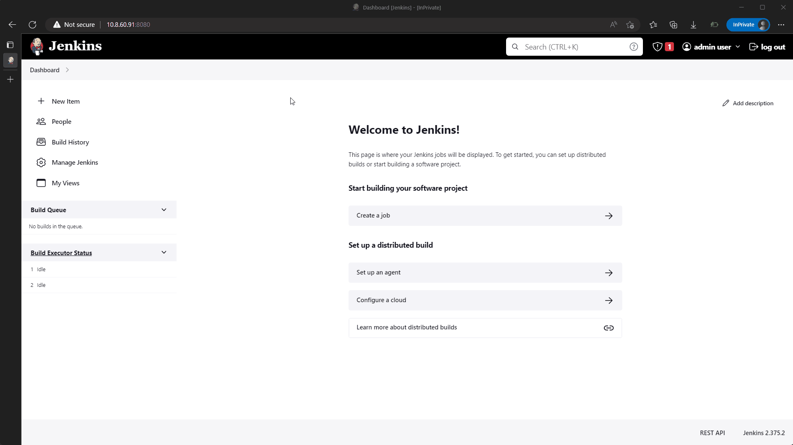
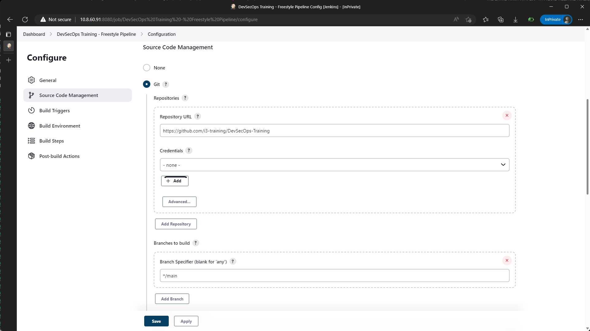
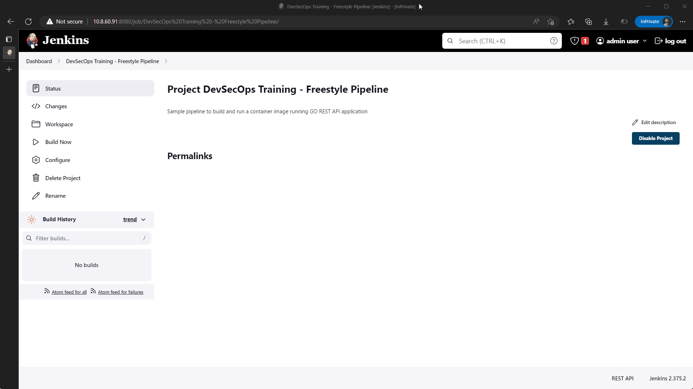

# Running Pipeline with Freestyle Job

A Freestyle pipeline in Jenkins is a type of Jenkins project that provides a configurable interface for building software projects. It allows developers to configure various build steps and settings, such as source code management, build triggers, build environment variables, build scripts, and post-build actions. The Freestyle project provides a wide range of flexibility and can be used for simple and complex projects alike. The pipeline view can be used to visualize the entire build process.

## 1. Create Freestyle Project

Create freestyle pipeline click on New Item, Give your pipeline a name and then select Freestyle Project as shown by picture below.



## 2. Configure Build

Couple of value we need to add for this pipeline as listed below,

1. Description field so we can easily recognize the propose of this pipeline.

    

2. Source Code Management field, here we need to add our source code hosted on git, if your source code in a private repository, you need to give credential so jenkins can pull the repository, on Branches to build select your desire branch.

    

3. Build Steps is where we define the way our application si build. in this example the pipeline will be separate to 3 step. First step is to build the application and package it as container image.

```bash
echo "BUILD CONTAINER IMAGE" 
docker build --pull --rm -f "app/go-sample/Dockerfile" -t go-app:sample1 "app/go-sample"
```

Second step is to run the image on the vm itself and expose the application to outside network.

```bash
echo "RUN IMAGE AS CONTAAINER"
docker run --name gorest --rm -d -p 80:80/tcp -p 9090:9090/tcp go-app:sample1
```

Third step is using `curl` to access the application and see if the application is running correctly.

```bash
echo "ACCESS TO CHECK APP"
curl 127.0.0.1:9090/articles
curl 127.0.0.1:9090/article/1
```

Apply and save your project configuration.

## 3. Run Your Pipeline

After you save the project configuration you will be redirected to project overview, Select Build Now to run the project, when project is running you can inspect build process and find details regarding build itself, from here you can troubleshot if theres issue during build, image below show of how build process running and its logs.

