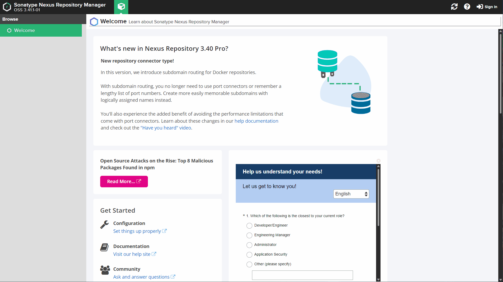
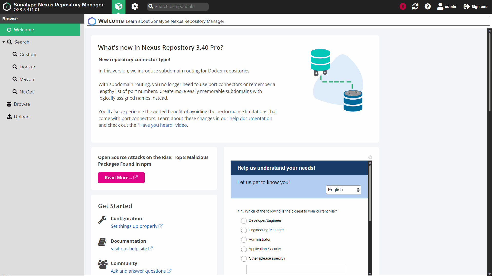
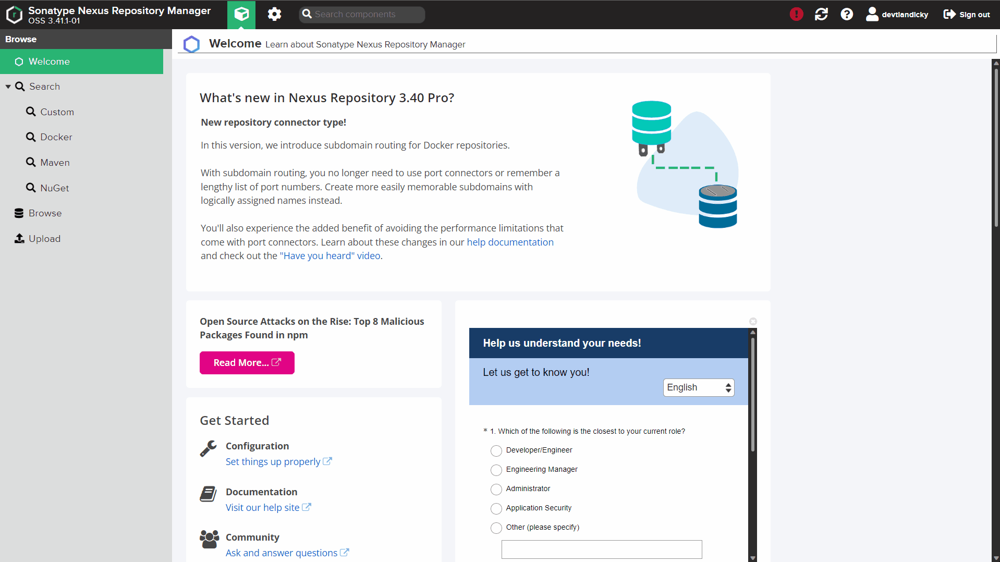
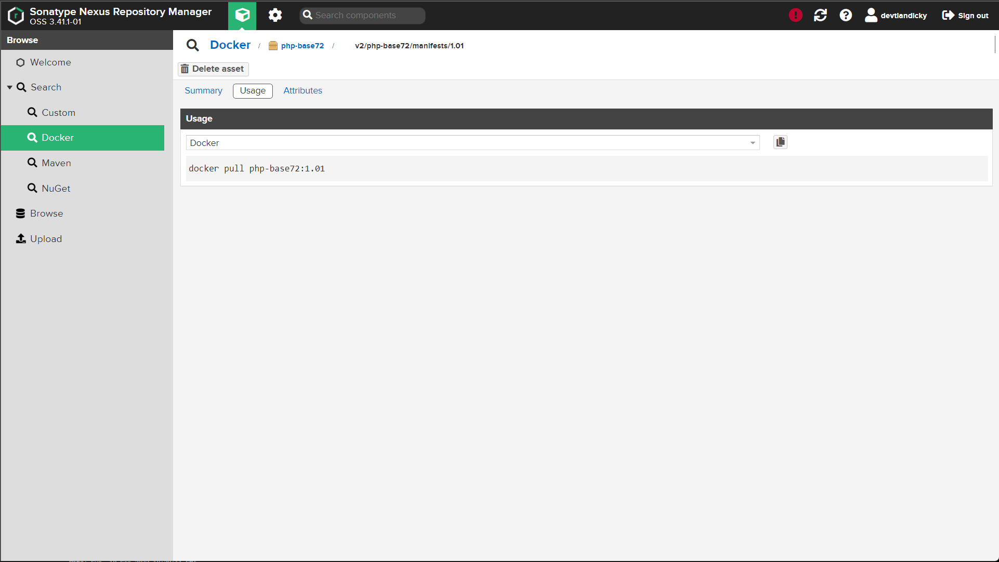

# Push and Pull docker image from private registry

## Configure Nexus repo

### 1. Adding new user

For security concern we won't allow anonymous access to our repo because of this we need to create user to give user in our organization access to the registry, gif below showing how to create a user in nexus.



First you need to login in web console then open server administration and configuration, on the side bar click user then select Create local user, fill the form then click Create local user.

### 2. Create docker repository

#### 2.1 Create new Blob storage

Before create a new repository its a good idea to create a new blob storage to separate data between repository, in this case we will create a new blob storage to store our images, to create a new blob storage follow steps below.



Login to your nexus web console then open server administration and configuration, on the side bar click Blob stores then select Create Blob Store to create new blob storage, first select type as an file since we will using local storage, then give your blob a name and specify your blob location, you can also create Quota for your blob here after that save the change and new blob storage is created and ready to be use by an repository.

#### 2.2 Create Repo

After creating blob to store our image binary, now we need create a repo, the repo will use blob that we created before as storage media, step by step will be shown by image below.



After login open server administration and configuration menu then select repositories, click on Create repository here you will be have some option available select `docker (hosted)` to create internal registry, on Create repository form fill the option such name (indicate your repo name), Online (to accepts incoming requests), HTTP and give port that you want (user will connect to the registry via this port), on storage option select blob storage that we just created before, then create the repo.

### 3. Setting up local machine

To connect with the registry you can use this command.

```bash
docker login myregistrydomain.com:port
```

You will be prompted for your username and password

> **Note**
>
> since we don't configure our registry with SSL docker login wont work, we need to configure our registry as insecure-registries to bypass TLS verification, the step will be explain below.

Edit the `daemon.json` file, whose default location is `/etc/docker/daemon.json` on Linux or `C:\ProgramData\docker\config\daemon.json` on Windows Server. If you use Docker Desktop for Mac or Docker Desktop for Windows, click the Docker icon, choose Preferences (Mac) or Settings (Windows), and choose Docker Engine. Then add following entry

```config
{
  "insecure-registries" : ["myregistrydomain.com:port"]
}
```

save the `daemon.json` file and restart docker, to change take efect, after docker is restarted you can use login command above to login to your registry.

### 4. Pushing an image to the registry

Build your image  with tag that indicate your registry as example `myregistrydomain.com:port/image-name:0.01`
or alternatively you can tag existing image to be push to your registry.

```bash
# Build new image from dockerfile/containerfile
docker build -f /project-dir/dockerfile -t myregistrydomain.com:port/image-name:0.01 .

# Tag existing image to remote registry
docker tag existing-image:0.01 myregistrydomain.com:port/image-name:0.01
```

after image is tag with remote registry domain or ip address we can push the image to the registry.

```bash
docker push myregistrydomain.com:port/image-name:0.01
```

it will showing output as shown below.

```bash
The push refers to repository [10.8.60.126:5000/php-base72]
47bc23effc15: Pushed 
ee36a60a1682: Pushed 
0f688ab01ffa: Pushed 
54e3206bdb11: Pushed 
5a956476e24e: Pushed 
6d88bb489305: Pushed 
a7bfd861243f: Pushed 
1da30dcf5ecb: Pushed 
cca79f034738: Pushed 
c08bb97307de: Pushed 
2b5724e99e93: Pushed 
72289fa6c929: Pushed 
77cae8ab23bf: Pushed 
1.01: digest: sha256:30f00da21ab946f6cb44dfe3f4bed29dd1cb96be7f514fcde4810602418e47ae size: 3041
```

Now we can check the image on nexus via web console, on home select search and select docker image being push will show here.

### 4. pulling an image from the registry

you can see your image from web console and refer there when trying to pulling the image as shown below



use standard docker pull command to pull the image

```bash
docker pull myregistrydomain.com:port/image-name:0.01
```
