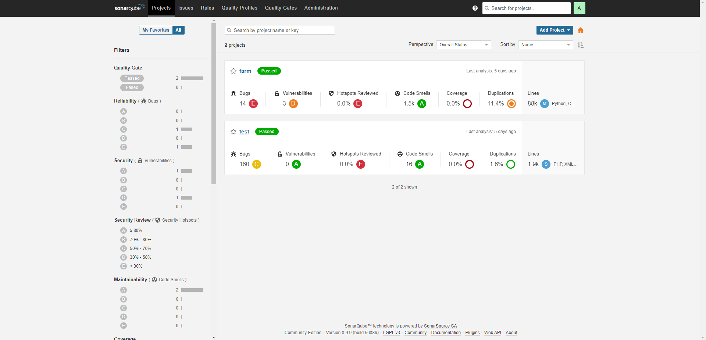
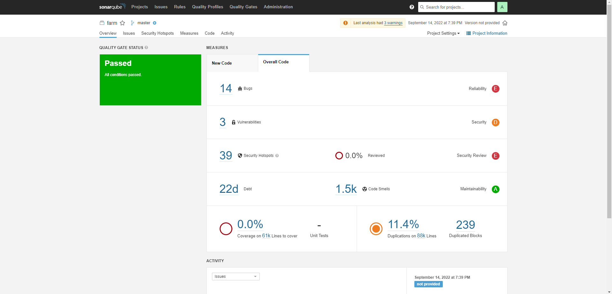
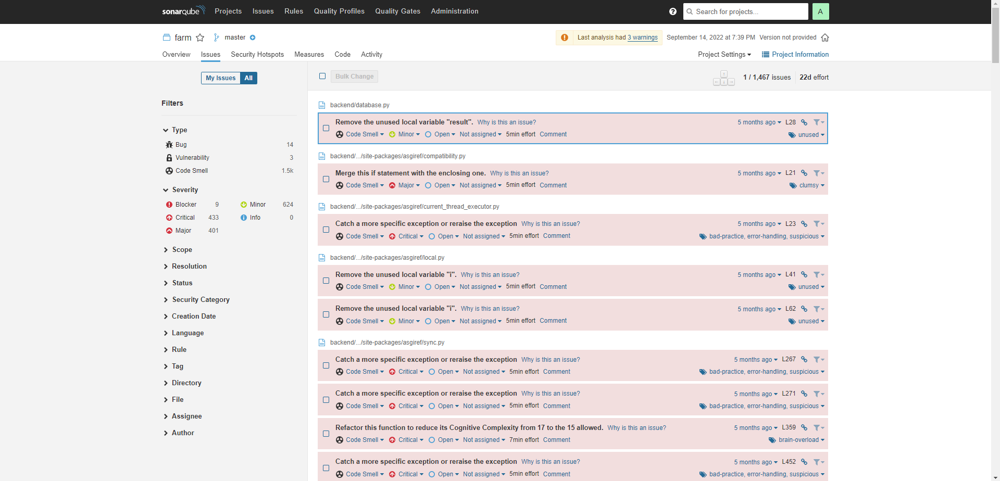
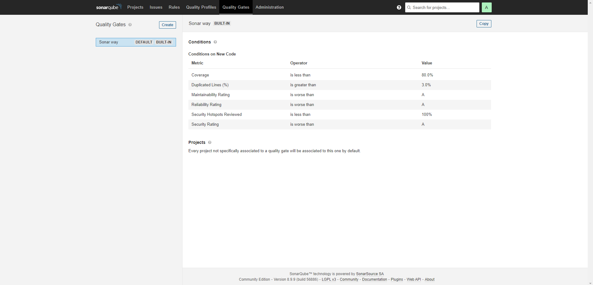

# Overview

Automated Static Analysis Tools (ASATs) analyze source-code to capture defects and ensure higher quality. SonarQube is provided as a service from the sonarcloud.io platform, or it can be downloaded and executed on a private server. SonarQube analyze the source code of the software and can efficiently detect various types of programming problems, like simple coding errors, vulnerabilities, performance issues, or design mistakes over twenty five programming languages. Languages supported by SonarQube include Java, JavaScript, Typescript, C++, C, C-Sharp, GO, Python, COBOL, Apex, PHP, and Swift. Developers add the SonarQube tools to the Continuous Integration Continuous Delivery (CI/CD) pipeline, this is as SonarQube has the capability to efficiently support during every major code change, as wanted designed by developers.

SonarQube is divided into four components. These components are SonarQube servers, database, plugins and sonar scanners. The servers perform three main tasks. Firstly, the web server of SonarQube browses through the snapshots as well as configure the SonarQube instance. Secondly, searches from the UI are backed by the SonarQube elastic search servers. Finally, there is the compute engine server. This server processes the code analysis report and saves its findings in the SonarQube database.

# Analysis Result

Now that we've analyzed our first project, we can go to the web interface at http://localhost:9000/. There we will see the report summary :



Discovered issues can either be a Bug, Vulnerability, Code Smell, Coverage or Duplication. Each category has a corresponding number of issues or a precentage value. Moreover, issues can have one of five different severity levels: blocker, critical, major, minor, and info. Just in front of the project name is an icon that display the Quality Gate status - passed (green) or failed (red).

Clicking on the one of project name will take us to a dedicated dashboard where we can explore issues particular to the project in greater detail.



We can see the security hotspots, project code, activity, and perform administration tasks from the project dashboard – each available on a separate tab. Though there is a global issues tab, the issues tab on the project dashboard display issues specific to the project concerned alone:



The issues tab always display the category, severity level, tag(s), and the calculated effort (regarding time) it will take to recify an issue. From the issues tab, it's possible to assign an issue to another user, comment on it, and change its severity level. Clicking on the issue itself will show more detail about the issue. The issue tab comes with sophisticated filters to the left. These are good for pinpointing issues. User can find out if the codebase is healthy enough for deployment into production or not, that's what Quality Gate is for.

## SonarQube Quality Gate

A Quality Gate are the set of conditions a project must meet before it should be pushed to further environments. Quality Gates considers all of the quality metrics for a project and assigns a passed or failed designation for that project. It's possible to set a default Quality Gate which will be applied to all projects not explicitly assigned to some other gate.



A default quality gates from SonarQube is already there. Administrators can also create new custom Quality Gates and set the values inside.

# Integrating SonarQube into Jenkins

Here are some examples for Jenkins's pipeline to integrating SonarQube:

```bash
 pipeline {
 ...
        stage('Sonnar-Scanner') {
                steps {
                        sh '''
                        "your-sonarscanner-directory"
                        Dsonar.projectKey="your-key" \
                        Dsonar.sources=. \
                        Dsonar.host.url=http://localhost:9000/ \
                        Dsonar.login="your-token"
                        Dsonar.qualitygate.wait=true
                        '''
                        }
 ...
 }
```
