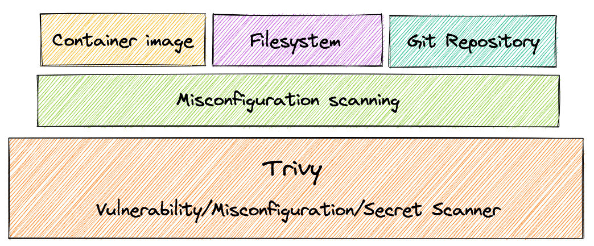
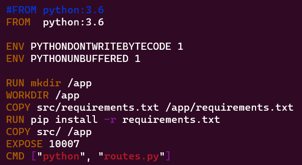
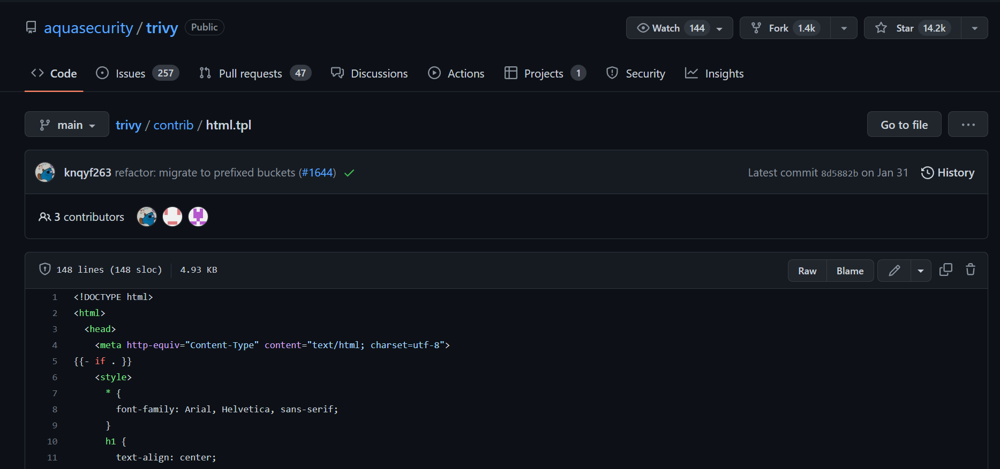
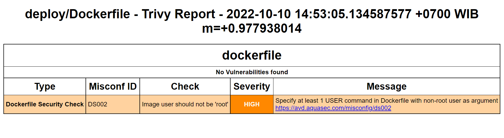
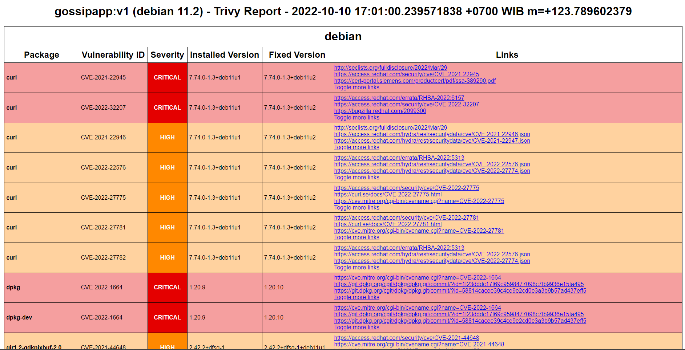
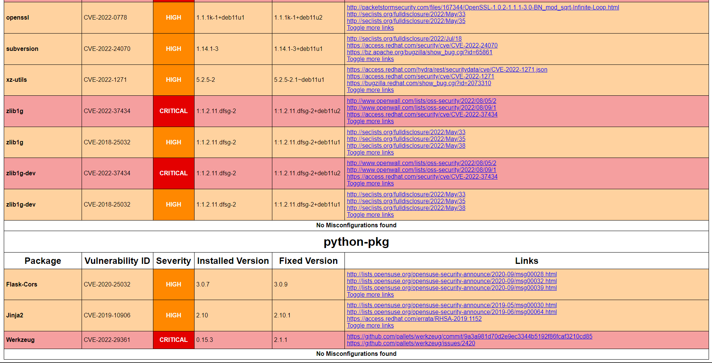

# Trivy Report



## Dockerfile

This is the Dockerfile in the gossip app sample project .



## Export Report

To make it easier to read the results of the reports obtained from Trivy, we can export the analysis results from trivy into html format. We need to first create an html.tpl file in the app/deploy/ folder based on the format in the link below. This template will be used to export the results of the analysis. Here I am using httpd server to read .html files . <br />
[Click Me](https://github.com/aquasecurity/trivy/blob/main/contrib/html.tpl)



## Filter Vulnerabilities

#### Hide Unfixed Vulnerabilities

By default, Trivy also detects unpatched/unfixed vulnerabilities. This means you can't fix these vulnerabilities even if you update all packages. If you would like to ignore them, use the --ignore-unfixed option.

#### By Severity

Use --severity option to generate reports based on severity

## Misconfig Scanner

The Misconfig Scanner is used to scan the Dockerfile before the image is created, as the example below shows that the container must be run as a rootless container.
Run the trivy misconfiguration scanner command in the app/ folder.

```bash
# This is a command to ask trivy to scan with severity HIGH and CRITICAL, in which the report results are exported using the html.tpl template that has been prepared previously.
trivy config . --format template --template "@deploy/html.tpl" -o /var/www/html/trivy/reportconfig.html --severity HIGH,CRITICAL
```



## Build Image

Continued by building the Dockerfile into an image. Run command below in the ../app folder.

```bash
docker build -t gossipapp:v1 -f app/deploy/Dockerfile app/
```

## Vulnerability and Secret Scanner

Vulnerability Scanner is used to scan if there are vulnerabilities that occur in the image, and can be fixed by updating the image. Trivy scans container image to detect exposed secrets like passwords, api keys, and tokens. Run the command below in the app/deploy/ folder to ask trivy to scan the gossiapp:v1 image that was built earlier .

```bash
trivy image --format template --template "@html.tpl" -o /var/www/html/trivy//reportimagesecretpython.html --ignore-unfixed --severity HIGH,CRITICAL gossipapp:v1
```


</br> </br>

Based on report analysis conducted by trivy, that Python:3.6 image has many vulnerabilities, and no secret key was found in the image. Trivy also discovered vulnerabilities in the libraries, modules, and packages themselves that were used when developing the project.
