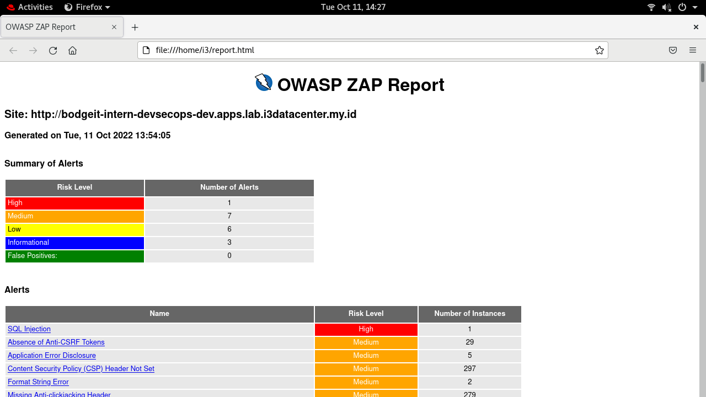
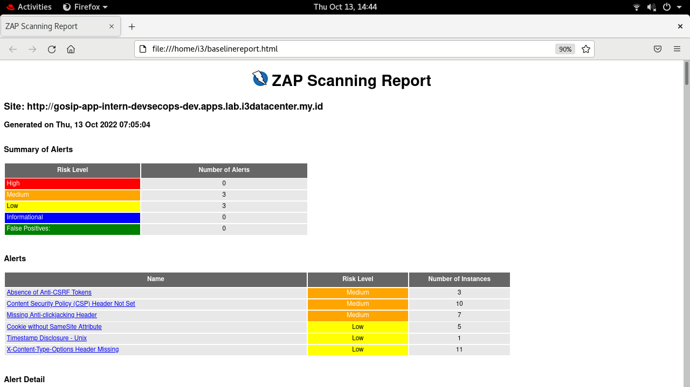
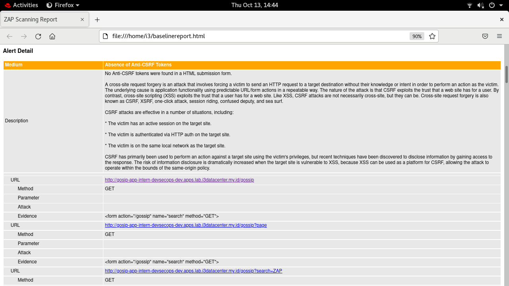
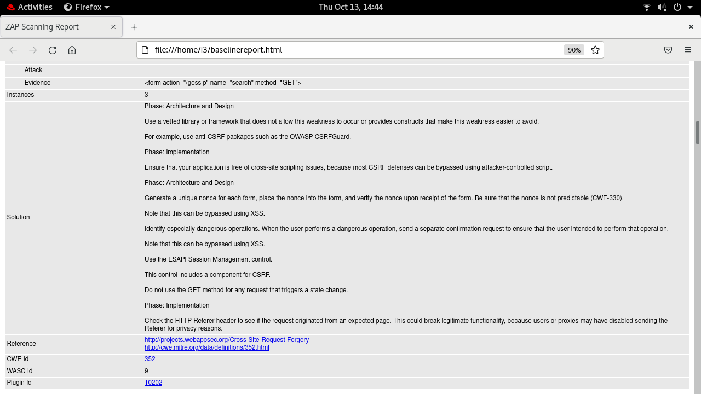
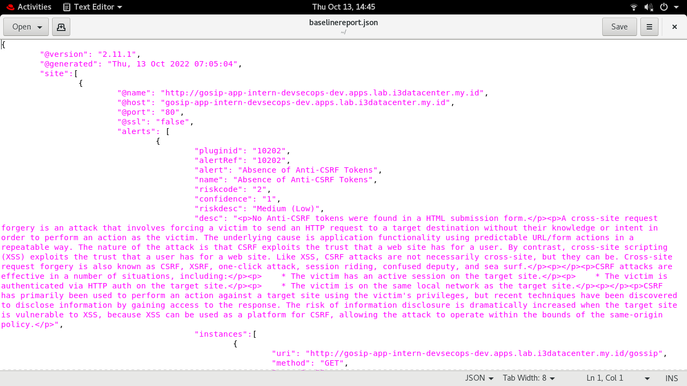
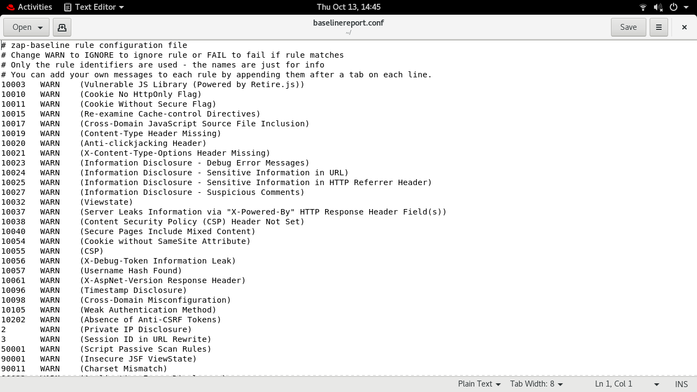

# Export Result Scan to HTML/JSON

## ZAP
- In ZAP, use : ```-quickout <filename>``` to export result.

- When scanning, run this command 
```bash
zap.sh -daemon -quickurl http://bodgeit-intern-devsecops-dev.apps.lab.i3datacenter.my.id -quickout $(pwd)/report.html
```

- Then, we can see the report in firefox.


## Docker
### Baseline Scan Report
- Example Command
```bash
docker run --rm -v $(pwd):/zap/wrk:rw -v /opt/hosts_zap:/etc/hosts -t ictu/zap2docker-weekly zap-baseline.py -I -j \
-t http://gosip-app-intern-devsecops-dev.apps.lab.i3datacenter.my.id/ \
-r baselinereport.html \
-J baselinereport.json \
-g baselinereport.conf \
--hook=/zap/auth_hook.py \
-z "auth.loginurl=http://gosip-app-intern-devsecops-dev.apps.lab.i3datacenter.my.id/login \
auth.username="user" \
auth.password="password""
```

- Command options for Exporting the result :
```
#Note
-g gen_file     : Generate default config file (all rules set to WARN)
-r report_html  : File to write the full ZAP HTML report
-J report_json  : File to write the full ZAP JSON document
```

### HTML Report




### JSON Report


### CONFIGURATION


```
Note :
The Full Scan and API Scan Report is not different from the Baseline Report.
The difference is only the content of the scanning results.
For the display, there's no difference.
```

## Jenkins
```bash
pipeline {
    agent any
    stages {
        stage('Zap Proxy') {
            steps {
                    sh '''
                    docker run --rm -v /zap:/zap/wrk:rw -v /opt/hosts_zap:/etc/hosts -t ictu/zap2docker-weekly zap-baseline.py -I -j \
                    -t http://gosip-app-intern-devsecops-dev.apps.lab.i3datacenter.my.id/ \
                    -r reportzap.html \
                    -J reportzap.json \
                    -g reportzap.conf \
                    --hook=/zap/auth_hook.py \
                    -z "auth.loginurl=http://gosip-app-intern-devsecops-dev.apps.lab.i3datacenter.my.id/login \
                        auth.username="user" \
                        auth.password="password""
                    mkdir /var/www/html/zapReport/pipeline${BUILD_NUMBER}/                              
                    cp /zap/* /var/www/html/zapReport/pipeline${BUILD_NUMBER}/
                    rm -rf /zap/*
                    '''
            }
        }
      
    }
}
```
